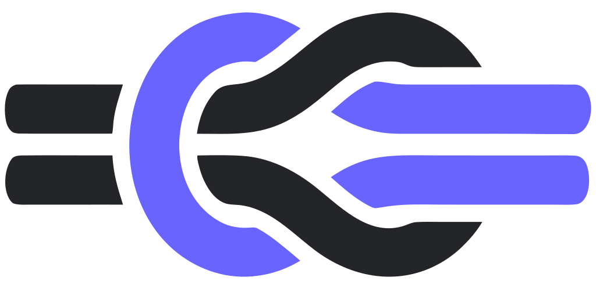

<p align="center">
  <picture>
    <source media="(prefers-color-scheme: dark)" srcset="frontend/public/logoDark.svg">
    
  </picture>
</p>

# agent-knots

> A self-hosted, task-based orchestrator for AI agents. You stay in control.

[](LICENSE)
[](pyproject.toml)
[](tests/)

agent-knots is a self-hosted, task-based orchestrator for AI agents.
Create a task, assign it to an agent, and watch it work in real time
from a browser or terminal. Take over mid-task whenever you want.
Everything is tracked against the task, not a single chat session, so
you keep hold of the bigger picture across a long-running project
instead of losing it every time a session ends.

Manage tasks across different workspaces, create custom agent workflows,
configure agent isolation, and step in to take control of the agent
whenever you need.

Built on [Strands Agents SDK](https://github.com/strands-agents/sdk-python).
Provider-agnostic: configure OpenAI, Anthropic, Ollama, DeepSeek, or any
OpenAI-compatible API in Settings. Developed and tested against MiniMax
M2.7 and DeepSeek.

---

## Quickstart

```bash
git clone https://github.com/JamieDF/agent-knots.git
cd agent-knots
./install.sh

# Launch the web cockpit (GUI is the default and primary surface).
agent-knots launch --port 8080
# → http://127.0.0.1:8080/?token=...
# First launch opens a setup wizard in the browser to configure your
# model provider (API key, model, base URL). No manual config needed.

# Or launch the TUI instead
agent-knots launch --tui
# → j/k navigate, Enter focus, a assume, r relinquish, t tools, d delete, q quit
```

`install.sh` installs [`uv`](https://docs.astral.sh/uv/) if missing, syncs
Python dependencies, builds the web frontend (needs Node.js; skipped with
a warning if not found), and installs the `agent-knots` command globally
via `uv tool install`. Safe to re-run.

**Skipping the setup wizard** (scripted installs, CI, containers): export
`AGENT_KNOTS_API_KEY` / `AGENT_KNOTS_MODEL` / `AGENT_KNOTS_BASE_URL` before
first launch, or write `~/.agent-knots/settings.yaml` directly. Either
way, `configured` is true before the wizard would even ask. See
[`docs/quickstart.md`](docs/quickstart.md) for the settings file format.

---

## Features

- **Sessions**: start and stop agents from the web UI, TUI, or CLI, each
  running in-process (container isolation is on the roadmap) and given a
  human-readable name (e.g. "sleepy-panda") instead of a raw id.
  Task-attached sessions get their own git branch, reused automatically
  if you resume the task later. A session pauses once its task reaches
  review (so rejecting a change with feedback resumes the same
  conversation instead of losing it) and stops for real once the task
  reaches done or abandoned. A stopped session's full transcript is
  kept and can be reopened read-only afterward, not just while it's
  running.
- **Multi-agent**: an advisory role (e.g. a read-only reviewer) can share a
  task alongside the main agent, and an agent can delegate a sub-task to its
  own sub-agent.
- **Live observability and control**: watch an agent's terminal, files, and
  command log in real time, not just its chat output, and take over any
  agent mid-task from a browser or terminal.
- **Tasks**: SQLite-backed (`state.db`), Draft → Open → In Progress → Review → Done, with
  a review gate only a human can pass, dependencies, acceptance criteria,
  and a configurable Kanban board. A workspace-attached agent always knows
  which workspace it's in and can only create, read, or list tasks inside
  it.
- **Playground**: one click on a fresh install stands up a real
  half-built project — a colour palette generator that was itself built
  with agent-knots — arriving with the genuine tasks that built it.
  Seven done, one waiting on review, three never started, each with the
  real progress log from the agent that worked it. Somewhere to look
  around before setting up a workspace of your own.
- **Managed workspaces**: point a workspace at a repo URL or a folder you
  already have, and agent-knots clones it into a folder it owns
  (`~/agent-knots/workspaces/<repo>/` by default, configurable). Agents
  work on the copy, so the checkout open in your editor is never touched
  and they always start from a clean tree. A workspace doesn't have to
  be a repo at all — leave it blank and you still get a real folder,
  shared by every session in that workspace. Pointing straight at an
  existing folder is still supported, and is what every pre-existing
  workspace does.
- **Review**: a dedicated screen for tasks sitting in review — see the
  task's own details alongside its file changes, approve (per file or
  all at once) to commit and move it to done, or reject with a reason
  that goes straight back to the agent, same conversation. Works on
  non-git workspaces too, where you review the task itself. Approving
  commits; pushing is a separate, explicit action by default.
- **Finishing a task**: approved work doesn't stop on its branch. Once a
  task is done, **Merge into main** lands it on the workspace's base
  branch — or **Open pull request** does it through GitHub instead, via
  the `gh` CLI. Chosen per workspace, because it isn't a preference:
  merging locally suits a solo or local repo, a PR suits a team repo
  with a protected mainline. Either can be set to happen automatically
  as part of approving.
- **Vault**: AES-256-GCM encrypted credential store. Agents can use a
  credential in a tool call without the raw value ever appearing in their
  context.
- **Providers**: OpenAI, Anthropic, Ollama, MiniMax, DeepSeek, or any
  OpenAI-compatible API, configurable per workspace.
- Also included: a TUI cockpit, custom shell-command tools, multi-workspace
  project grouping, and per-app accessibility settings.

See [`roadmap.md`](roadmap.md) for what's not built yet.

---

## CLI Reference

```
agent-knots
├── session
│   ├── start [--task <id>] [--project <id>] [--mode agent|assistant] [--prompt <text>]
│   └── list
├── cockpit
│   └── launch [--web] [--port 8080]
├── task
│   ├── create <title> [--priority low|medium|high|urgent] [--criteria ...]
│   ├── list [--status open] [--project <id>]
│   ├── show <id>
│   ├── update <id> [--status <s>] [--assign <agent>]
│   └── delete <id>
├── vault
│   ├── init, unlock, lock, status
│   ├── add <id> [--value ...] [--tag ...]
│   ├── list, show <id>, remove <id>
│   ├── audit [--credential <id>] [--limit <n>]
│   └── template
│       ├── add <cred-id> --name <n> [--env <json>] [--file <path>] [--wrapper <cmd>]
│       ├── list <cred-id>, show <cred-id> <name>
│       └── remove <cred-id> <name>
├── project
│   ├── create <id> --name <n> [--repo <url>] [--managed] [--init-git] [--branch <b>] [--tag ...]
│   ├── list, show <id>
│   ├── update <id> [--name ...] [--repo ...] [--branch ...]
│   └── delete <id>
├── playground            # maintainer tooling for the demo repo
│   ├── export --project <ws> [--repo <path>]
│   └── show <repo>
└── version
```

---

## Architecture

```
┌─ agent-knots ──────────────────────────────────────┐
│                                                   │
│   Web UI (React SPA)    TUI (Textual)             │
│       ↕ REST + SSE         ↕ asyncio.Queue        │
│   ┌────────────────────────────────────────────┐ │
│   │         FastAPI web server                  │ │
│   │  Token auth, SSE streaming, REST API        │ │
│   └────────────────┬───────────────────────────┘ │
│                    │                              │
│   ┌────────────────▼───────────────────────────┐ │
│   │     Session Manager                         │ │
│   │  InProcessRuntime · git branch per session   │ │
│   │  ┌──────────────────────────────────────┐  │ │
│   │  │  Strands Agent (any provider)          │  │ │
│   │  │  12 tools: editor, shell, task mgmt   │  │ │
│   │  │  Sandbox: cwd isolation + path guard  │  │ │
│   │  └──────────────────────────────────────┘  │ │
│   └────────────────────────────────────────────┘ │
└───────────────────────────────────────────────────┘
```

## Project layout

```
agent-knots/
├── frontend/                  # Vite + React SPA (web cockpit)
│   └── src/
│       ├── views/             # Dashboard, Tasks (Board/List), TaskDetail,
│       │                      # AgentThread, Review, Workflows, Settings
│       ├── components/        # Topbar, TaskDialog, WorkspaceDialog, Markdown, ...
│       └── lib/               # API client, SSE client, workspace context
├── src/agent_knots/
│   ├── cli/                   # Typer CLI entry point + commands
│   ├── cockpit/
│   │   ├── tui/               # Textual TUI (overview, focus, tools)
│   │   └── web/               # FastAPI server (auth, SSE, REST, SPA shell)
│   ├── session/                # SessionManager, InProcessRuntime, delegation
│   ├── storage/               # SQLite state.db and store factories
│   ├── task/                  # Task models, SQLite store, Strands tools for agents
│   ├── vault/                 # AES-256-GCM crypto + file store
│   ├── project/               # Workspace models + SQLite store
│   ├── tools/                 # Tool registry, defaults, custom tools
│   ├── wastebin.py            # Stopped-session tombstones + full history + retention
│   ├── names.py                # Human-readable session names ("sleepy-panda")
│   ├── gitutil.py             # Per-session branch create/resume/teardown
│   ├── settings.py            # Global YAML settings store
│   ├── provider.py            # Model provider resolution (CLI/env/settings)
│   ├── isolation.py           # Workspace sandbox config
│   └── sandbox_tools.py       # Sandboxed shell/editor tools
├── tests/                     # Python unit tests (668)
├── docs/                      # ADRs, architecture, plan
└── pyproject.toml
```

---

## Testing

```bash
# Python unit tests (668)
uv run --with pytest pytest tests/ -q

# Playwright e2e tests (76: 74 passing, 2 skipped)
cd frontend && npx playwright test
```

A handful of the Playwright tests need a real LLM provider configured
and are expected to fail without one.

---

## Status

**Alpha, feature-complete.** Provider-agnostic; developed and tested against
MiniMax M2.7 and DeepSeek.

---

## Contributing

Contributions welcome. See [`CONTRIBUTING.md`](CONTRIBUTING.md) for dev
setup, coding conventions, and the PR process. [`roadmap.md`](roadmap.md)
tracks what's shipped and what's next. [`CHANGELOG.md`](CHANGELOG.md) has
the full history.

---

## License

MIT. See [`LICENSE`](LICENSE).
